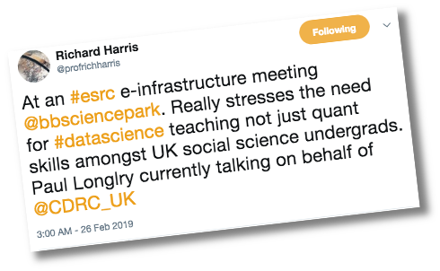
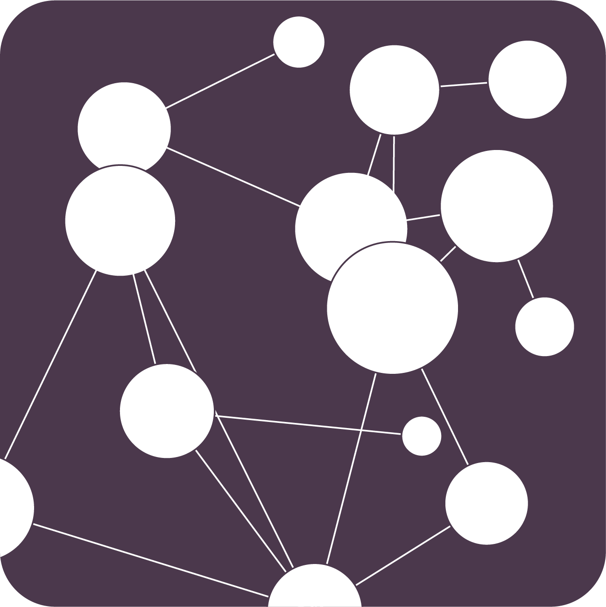
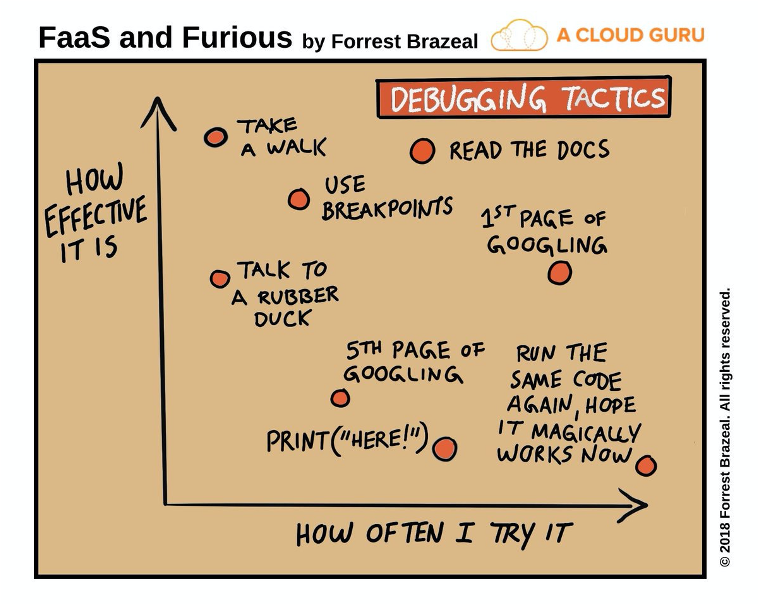

Title: 1.1. Getting Oriented
Author: Jon Reades
Theme: casa notes
Palette: Purple
Size: Wide
---
Layout: Title
Background: ./img/CASA_Logo_no_text.png
# Getting Oriented
## Key information to get you started...

^ This presentation contains key contact and delivery information about the module.

---
## Key Contacts (Staff)

|  Jon Reades  | Huanfa Chen   |
|----|----|
|   |   |
| Associate Professor in Spatial Data Science and Module Convenor. | Teaching Fellow in Spatial Data Science and Quantitative Methods. |
| j.reades-at-ucl... | huanfa.chen-at-ucl... |
| [CASA Page](https://www.ucl.ac.uk/bartlett/casa/people/dr-jonathan-reades) | [CASA Page](https://www.ucl.ac.uk/bartlett/casa/people/huanfa-chen) |
^ Most of your questions should be directed to me, as course convenor, or to Huanfa as teaching fellow.

---
## Key Contacts (PGTAs) 

| Melda Salhab | Philip Wilkinson |
|--------------|------------------|
|  |  |
| Postgraduate Teaching Assistant and 2nd year PhD candidate at CASA. | Postgraduate Teaching Assistant and 1st year PhD candidate at CASA. |
| melda.salhab.14-at-ucl... | |
| [CASA Profile](https://www.ucl.ac.uk/bartlett/casa/melda-salhab) | |
^ I've also provided contact information for our two fantastic PGTAs, but please bear in mind that they should _not_ be your first point of contact for most things. 
^ It's fine to reach out to them for two reasons: 1) because you are meant to be in a practical session and are unable to join for some reason; 2) because there's an issue that you don't feel comfortable raising directly with me.

---
## How We Are Running Things... 

- **Lectures**: these will be pre-recorded and divided up into shorter segments that are easy to follow. I will do everything in my power to make them available to you by the Thursday *before* the 'lecture'.
- **Padlet**: this is an online tool that we will use as the group whiteboard to help prioritise challenges, share triumphs, reflect on the readings.
- ~~Lecture~~**Workshop**: Mondays 1–3pm. Your input to the Padlet will guide the first half of each week's 'workshop'. The second half will be 'live coding' in an **I do/We do** format.
- **Practical**: *either* Mondays 4–6pm *or* Wednesdays 10am–12pm *or* Thursdays 8-10am. This will be the **You do** part.

^ People auditing: please try to get to the Monday pm session, and keep in mind that whatever session you're in, the students need to have proiority.

---
## Assessments

- **Timed Skills Assessment%** (15% of module grade; 2 hours; 3 for those with *Inclusion Plans*): A quiz designed to test students' understanding of basic Python concepts covered in the module.
^ **1** Students may begin the test at any time in a 24-hour window, but once begun they will have 2 hours to complete the test. The time limit is 3 hours for students with Inclusion Plans. This will be made available after the 2nd practical session in Week 3.
- **Data Set Biography** (25% of module grade; 1,000 words max): A structured reflective essay in which students are prompted to reflect on their understanding of the interactions between the technical and theoretical elements of the module.
^ **2** A Markdown document submitted in Week 6 (after Reading Week). The word limit for this submission is 1,050 words (including reproduction of the questions). The data set for which the 'biography' will be written is the Inside Airbnb data for London.
- **Data-Led Executive Briefing** (60% of module grade; 2,500 words max): A data-led briefing in which students present, for example, a technical analysis that might inform public policy or market research.
^ **3** A Jupyter notebook submitted at the start of Term 2. There are two parts to the notebook: an Executive Briefing and a Reproducible Analysis. The word limit for the Executive Briefing portion of the notebook is 2,500 words. There is no limit to the amount of code in the Reproducible Analysis portion of the notebook.

---
### How to 'Ace' the Assessments?

>  *Study* like you're learning a new language. *Do* the readings. *Talk* to other students. *Ask* for help when you need it!

^ More on how to ask for help below!

---
## Where Does I2P Fit?

- **Geographic Information Systems (GIS)**
  - Foundations of spatial analysis
  - Working with geo-data
- **Quantitative Methods (QM)**
  - Foundations of statistical analysis
  - Working with data
- **Intro to Programming (I2P)**
  - Integrating and applying concepts from GIS & QM
  - Developing programming and practical analysis skills

---

## What Are We Trying to Do?

This class hopes to achieve three things:

1. To teach you the basics of how to *code* in Python.
2. To teach you the basics of how to *think* in Python.
3. To show you how the concepts *taught* in GIS and Quantitative Methods can be *applied* to a practical (spatial) data analysis problem.

These skills are intended to be transferrable.

---
## Overall Structure

- **Weeks 1-4:** baking in the 'basics'
- **Weeks 5-7:** engaging with data. 
- **Weeks 8-10:** making sense of data 
^ **1-4** means tackling the 'basics' of Python, foundational concepts in programming, and practicing with the 'tools of the trade' for programmers.
^ **5-7** means different *types* of data (numeric, spatial and textual) with a view to understanding how such data can be cleaned, processed, and aggregated for use in a subsequent analysis. It is commonly held that 80% of 'data science' involves data *cleaning*, so this is a critical phase in developing an *understanding* of data.
^ **8-10** is about visualisation, classification, dimensionality reduction, and clustering. These concepts will have been encountered in other modules, so the intention is that the student will see how these fit into the 'bigger picture' of applied spatial analysis.

---

### Also...

We hope to convince you that:
- Anyone---and this includes **you**---can code. 
- Learning to code does *not* require mathematical ability.
- Learning to code does *not* require linguistic ability.
- Learning to code *does* require practice. And more practice. And more again.

---
### Consequences...

- If you only code during the practical session then you will *not* learn how to code. 
- If you cram the night before then you will *not* learn how to code.
- If you practice for 45 minutes a day then you *will* learn how to code.

---
Layout: Split
### A Bit of Perspective

Students face the risks of the de-skilling of geography and planning at one end, and being subsumed by data science at the other…

+++

---

### The challenges

- Different style of learning from what you might be used to (“I didn't anticipate, or rather factor into my schedule, the amount of out-of-hours practice that was required to stay up to date.”).
- Doing stats *and* programming *at the same time* and connecting this all back to the bigger picture.
- Delayed gratification (you have to walk before you can run).
- Easy to fall behind, but hard to catch up (“the pace is relentless”).

---
### The rewards

- Skills that are highly transferrable and highly sought-after professionally.
- Problem-solving and practical skills that are valued by the private and public sectors.
- A whole new way of seeing the world and interacting with it.
- Lots of support along the way… *if you remember to ask for it!*

---

### The implications

You will learn to code *best* if you treat it like learning a new language:

- Start simple and work up.
- Google is your friend (really).
- Talk with your friends (*i.e.* Slack).
- Immerse yourself and practice regularly.
- Do the readings *even* if we don’t address them specifically.
- Learn how to ask questions (*i.e.* Search Stack Overflow).
- Subscribe to a ‘magazine’ or two (*e.g.* Medium or Pocket).

---
Layout: SectionTitle
# Getting Help

---

### Study Aids

When you need an answer *right now*:

- [Google](https://www.google.co.uk) 
- [Stack Overflow](https://stackoverflow.com/questions/tagged/python)
- [Slack](https://casa-students-2020.slack.com/)

When you want to *learn more*: 

- [Medium](https://medium.com/search?q=python)
- [Pocket](https://app.getpocket.com/search/python)

^ Google will become more useful as you learn more and this is definitely one class in which "I Googled it" is a *good* answer.

^ As of early September 2020, Stack Overflow contains over 1.5 *million* Python questions alone! Chances are someone else has had your question before.

---

### Study 'Right'

I've tried to throw together some _ideas_ on how you can study effectively that covers everything from 'how to manage distractions' to 'how to email your prof (and get a reply!)'. 

It's in the ['Getting Help'](https://moodle.ucl.ac.uk/course/view.php?id=11291&section=4) section on Moodle. I'll update it periodically if I come across useful links/ideas/tips.

^ If you have a trick or technique that works for _you_ then I want to hear about it! And I'd encourage you all to share with your peers anything that helps you to stay focussed but also relaxed!

---

### *Before* You Ask for Help

From the [Computer Science Wiki](https://computersciencewiki.org/index.php/How_to_ask_for_help):

- Draw a picture of the problem
- Explain the problem to a rubber duck, teddy bear or whatever (really!)
- Forget about a computer; how would you solve this with a pencil and paper?
- Think out loud
- Explain the problem to a friend

To which I would add:
- Use `print(variable)` statements liberally in your code!

^ We'll cover this last bit as we get more used to coding!

---

### *Where* to Ask for Help

There is *no* shame in asking for help. None. We are here to support your learning and we have chosen a range of tools to support that:

- [**Slack**](https://www.slack.com): use public `#intro-to-programming` channel for help with coding, practical, and related course questions.
- **Office Hours**: use Teams to contact PGTAs and lecturers for 1:1 help with software, hardware, and more complex issues.
- **Out-of-Hours**: use email to raise personal circumstances and related issues for focussed support. Make use of Professional Services support as-needed to preserve privacy.

^ We'll talk about Slack more [later](./1,4-Tools_of_the_Trade.md), but we think that this is the best way to get help when you need it. Slack enables us to support you as a community of learners across computer / tablet / phone.

---

### *When* to Ask for Help

- When you get warning messages from your computer's Operating System.
- When you cannot get the coding environment to run _at all_.
- When even simple commands return line after line of error code.
- When you have no clue what is going on or why.
- When you have been wrestling with a coding question for more than 20 minutes (but see: *How* to Ask for Help!)

^ In order to learn you *do* need to struggle, but only up to a point! So we don't think that *giving* you the answer to a coding question as soon as you get stuck is a good way for you to learn. At the same time, I remain sad to this day that one of the most insightful students I've ever taught in a lecture context dropped out of our module because they were having trouble with their computer and thought it was *their* fault nothing was working right. By we had realised what was going on it was too late: they were so far behind that they didn't feel able to catch up. We'd *rather* that you asked and we said “Close, but try it again" than you didn't ask and checked out thinking that you couldn't 'do' programming.

---

### *How* to Ask for Help

I liked the "How to ask programming questions" page provided [by ProPublica](https://www.propublica.org/nerds/how-to-ask-programming-questions):

1. Do some research first.
2. Be specific.
3. Repeat.
4. Document and share.

If you find yourself wanting to ask a question on Stack Exchange then they also [have a guide](https://codereview.stackexchange.com/help/how-to-ask), and there are [plenty](https://codingkilledthecat.wordpress.com/2012/06/26/how-to-ask-for-programming-help/) of other [checklists](https://medium.com/better-programming/the-smarter-way-of-asking-for-programming-help-52cd140dc437).

---

## Learn from Your Mistakes

---

## Bug Hunt!

The [Knuth reward check](https://en.m.wikipedia.org/wiki/Knuth_reward_check) ('cheque') is "among computerdom's most prized trophies" [^1] but was almost never cashed! They were rewards for finding 'bugs' of any sort in Knuth's seminal books on programming.

[^1]: Ditlea, S., ["Rewriting the Bible in 0's and 1's"](https://www.technologyreview.com/s/400456/rewriting-the-bible-in-0s-and-1s/), MIT Technology Review.

---

### A.K.A. Catch Out the Prof!

Report a bug (or make a helpful suggestion) of any sort on GitHub using the [issues](https://github.com/jreades/fsds/issues) tracker then it will count towards your contribution to the module. 

At the end of the module I will work out whose contributions have done the most to advance the quality of the course and will make a donation of £20 to a charity of their choosing. I will announce the winner on Slack.

*Hunt on!*

^ I know that you'd prefer extra credit but that's not an option. Sorry.

^ I should note that I do _not_ mind being **reminded** that I've said this. It's going to be a busy term, but I hope you'll hold me to account. 

---

## One More Thing...

You will get things wrong. I will get things wrong. 

We will assume that you are trying your best. Please assume the same about us!

It's going to be messy, but I'm *really* excited about it!

---

### And Finally...

Do **not** allow your computer to auto-update during term. Inevitably, large OS upgrades will break developer tools. Do this by choice *only* when you have time. 

^ Many students allowed their computer to update to Big Sur last year and it broke their entire computing environment. Some did this shortly before a submission was due. Do *not* do this!

---

### Additional Resources

- See the GIS&T Body of Knowledge (BoK) for quick overview of concepts, techniques, and tools: [gistbok.ucgis.org](https://gistbok.ucgis.org/all-topics?term_node_tid_depth=97).
- A degree of 'plagiarism' is acceptable in **code** since that's how we learn; however, mindless copy+pasting of [Stack Overflow](https://stackoverflow.com) code leads to sphagetti and, often, incorrect results or difficult-to-squash bugs. Think of it like paraphrasing.
- To distinguish between plagiarism and paraphrasing [here's a nice tutorial](https://libguides.sjsu.edu/plagiarism/home-page) that you can also use to help you with your 'regular' writing.
.
