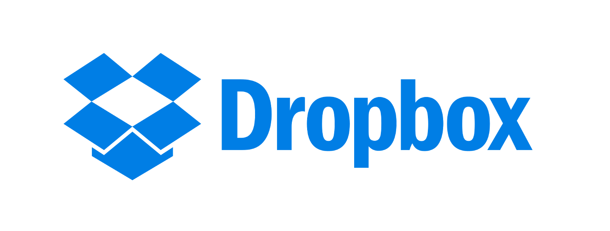
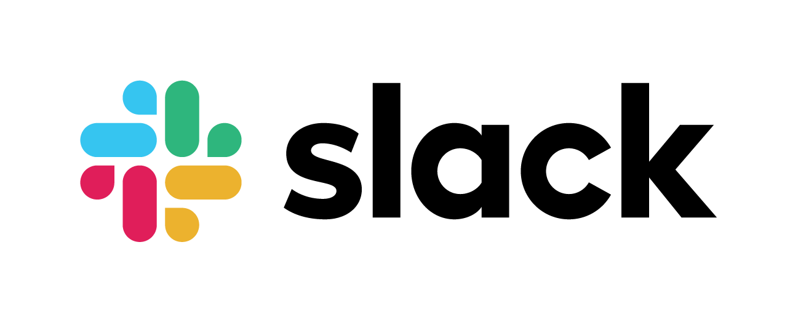
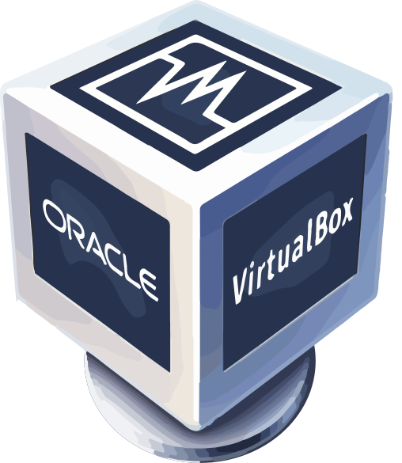
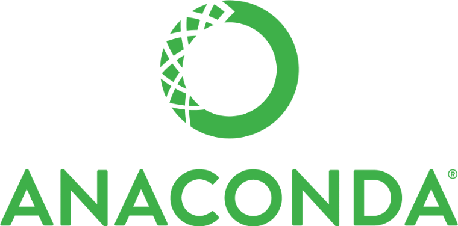

Title: Tools of the Trade
Author: Jon Reades
Theme: notes
Palette: Violet
Size: Wide
---
Layout: Title
# Tools of the Trade

---

## Basic Principles

- Software should be *free* (as far as practicable).
- Software should be *open* (as far as practicable).
- Software should *run* on all platforms.
- Software should *reflect* what you will encounter in the 'real world'.

---

## Tools to Make Your Life Easier

1. **Dropbox**: keep your stuff backed up in the cloud.
2. **Slack**: get help (or just tips and tricks) from peers and staff
3. **Docker/Vagrant/VirtualBox**: virtualisation platforms to ensure you don't 'hose' your computer.
4. **Python**: how we do 'data science'.
5. **GitHub**: manage your code, your data, even your essays/reports.
6. **Markdown**: focus on the *right* things while you write and treat your essays like code!

---

## Dropbox

Dropbox is a 'cloud-based file synchronisation tool': files placed in the special Dropbox folder are automatically uploaded to their servers, and automatically downloaded to any _other_ computer on which you have set up Dropbox. Changes are also synchronised every time you save the file.

---

### Why Use It?

We want you to use Dropbox for four reasons:

1. You can access your Dropbox files anywhere in the world via the Desktop or Web.
2. You have an backup of all of your work, even if your computer has a complete meltdown.
3. You have *limited* ‘versioning’ support, so if you accidentally overwrite an essay or file, you can recover a previous version.
4. Dropbox is how we collaborate, and it’s how many businesses work as well.

---

### We Recommend... 

That you keep *all* files that *aren't* in GitHub in your Dropbox folder. This applies to all your CASA MSc work!

Dropbox signup: [bit.ly/32jhdvN](https://bit.ly/32jhdvN)

---

## Slack

Slack is a “messaging app for teams” that is designed to reduce email, organise conversations & topics of discussion, and pull in relevant data from a host of other services in a flexible, fully-searchable way. 

---

### Why Use It?

We want you to use Slack for four reasons:

1. Moodle is clunky and formal—it works well for one-to-many communication, but not so much for ‘chat’.
2. Slack offers a searchable history—you will have access to this archive for as long as you need it.
3. You (and we) can access Slack on every major OS (OSX, Windows, iOS, Android, and Windows Phone) and via a browser *quickly*.
4. Slack is used in the ‘real world’ by everyone from Apple to PayPal and the JPL. This is how developers work.

---

### We Recommend... 

Install the Slack client on your phone and on your personal computer and start using it as *the* way to ask questions, share answers, and generally keep ‘up to date’ on things across the entire MSc.

Slack signup: [casa-students-2020.slack.com](https://casa-students-2020.slack.com)

*P.S.* Unless a question is **personal** it should normally be asked in the appropriate module channel.

---
Layout: HeaderAndColumns
## Docker, Vagrant & VirtualBox
+++

+++

+++

---
### Why Use It?

Collectively, these are “virtualisation platforms” that allow you to run a *second operating system* on your computer. We use these for four reasons:

1. Easier installation than Anaconda Python.
3. No spillover effects since each container is isolated.
3. Easy to destroy VMs when you’re done.
4. Used in the ‘real world’ by *many* companies (JP Morgan Chase, GSK, PayPal, Twitter, Spotify, Uber…).

---

### We Recommend...

This is new for us this year but was built in response to persistent issues with students ending up with different versions of packages, or even Python! If a virtual machine works for us then we *know* [^1] it also works for you. This is hard, we have tried to make it simple.

Download and install: [Vagrant](https://www.vagrantup.com/downloads) *and* [VirtualBox](https://www.virtualbox.org/wiki/Downloads).

*Only* if you are technically proficient should you use: [Docker Desktop](https://docker.com/products/docker-desktop).

[^1]: Not entirely true, alas.

---

## Anaconda Python

Anaconda Python is a 'flavour' of Python that comes packaged with useful tools for configuring and management. If virtualisation is too resource-intensive for your computer (*e.g.* because it’s older or doesn’t have enough RAM) then installing Python directly is the next-best option.

---

### Why Use It?

We use Anaconda Python for three reasons:

1. It is easy to create and configure virtual environments (each research project has its own environment).
2. Use of channels allows installation of cutting-edge libraries not yet packaged for ‘regular’ Python (install from GitHub, etc.)
3. Widely supported by developers with builds for most Operating Systems and a focus on data science applications.

It's what we use on the virtualised platforms as well.

---

### We Recommend...

If our Vagrant/VirtualBox tool doesn't work on your computer, then this is how we will get you up and running because it’s (fairly) robust and ‘standard issue’. However, we *can’t* guarantee you’ll get the same versions of every package as installed on the virtualised systems so differences may emerge.

If virtualisation doesn't work then you'll need to download the 'Individual Edition': [64-bit Graphical Installer](https://www.anaconda.com/products/individual)
\[[^unless]\]

[^unless]: Unless your computer is very, very old.

---

## Recap

1. With Anaconda Python we have a tool for assembling coding environments 'easily' from configuration files.
2. With Docker/Vagrant/VirtualBox we have a way to create a coding environment that is *isolated* from the computer and can be easily distributed online.
3. With Dropbox we have a place to store, backup, and share files (size limits apply).
4. With Slack we have a place to ask for/provide help.
