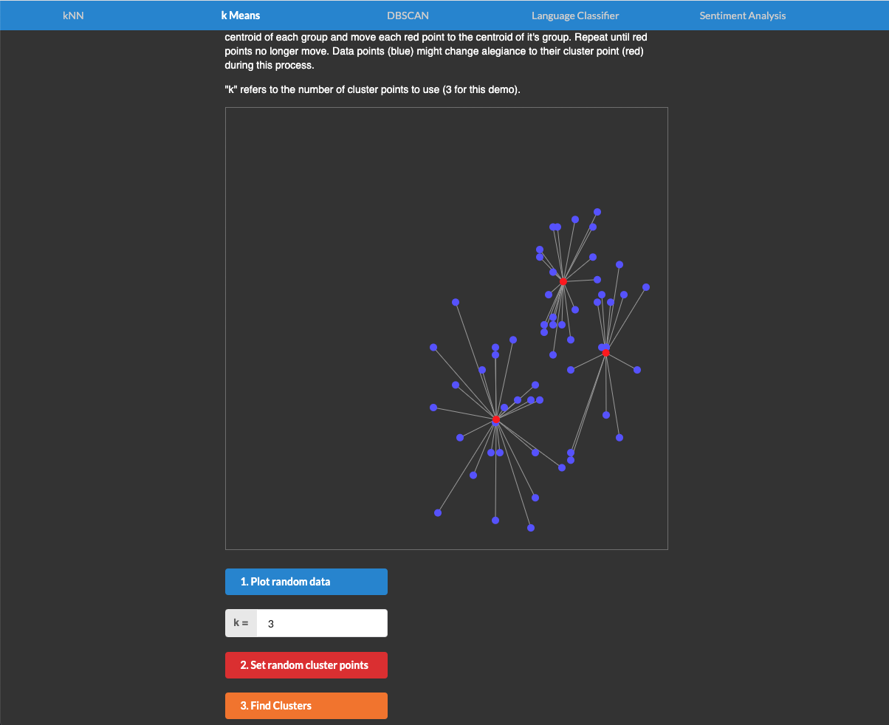

Theme: casa notes
Palette: Purple
Size: Wide
Title: File Formats
Author: Jon Reades

---

Layout: Title

# Clustering

---

Layout: Split

### Classification

- Allocates *n* samples to *k* groups
- Works for different values of *k* 
- Different algorithms *A* present different views of group relationships
- Poor choices of *A* and *k* lead to weak understanding of data
- Typically works in 1–2 dimensions

+++

### Clustering

- Allocates *n* samples to *k* groups
- Works for different values of *k*
- Different algorithms *A* present different views of group relationships
- Poor choices of *A* and *k* lead to weak understanding of data
- Typically works in 3+ dimensions

---

### World's First Geodemographic Classification?

Source: [booth.lse.ac.uk/map/](https://booth.lse.ac.uk/map/)

---

### More than 100 Years Later

Source: [vis.oobrien.com/booth/](http://vis.oobrien.com/booth/)

---

### Intimately Linked to Rise of The State

- Geodemographics only possible in context of a State – without a Census it simply wouldn’t work… until now?

- Clearly tied to social and economic ‘control’ and intervention: regeneration, poverty & exclusion, crime, etc.

- Presumes that *areas* are the relevant unit of analysis; in geodemographics these are usually called *neighbourhoods*… which should ring a few bells.

- In practice, we are in the realm of ‘homophily’, a.k.a. Tobler's First Law of Geography

---

### Where is it used?

Anything involving grouping individuals, households, or areas into larger 'groups'…

- Strategic marketing (above the line, targeted, etc.)

- Retail analysis (store location, demand modelling, etc.)

- Public sector planning (resource allocation, service development, etc.)

Could see it as a subset of *customer segmentation*.

---

Layout: SectionTitle

## Computational Context

---

### Problem Domains

|                  | Continuous               | Categorical    |
| ---------------- | ------------------------ | -------------- |
| **Supervised**   | Regression               | Classification |
| **Unsupervised** | Dimensionality Reduction | Clustering     |

^ In classification we 'know' the answer (labels).

^ In clustering we don't 'know' the answer (clusters).

---

> What is a cluster?

^ A group of *similar* data points.

---

> What is the purpose of a clustering?

^ To *generalise* from 'raw' data.

---

Layout: SectionTitle

## Geodemographics is a Business

---

### Experian

Specialist in consumer segmentation and geodemographics ([bit.ly/2jMRhAW](http://bit.ly/2jMRhAW)).

- Market cap: £14.3 *billion*.

- Mosaic: “synthesises of 850 million pieces of information… to create a segmentation that allocates 49 million individuals and 26 million households into one of 15 Groups and 66 detailed Types.”

- More than 450 variables used.

Most retail companies will have their own segmentation scheme. Competitors: CACI, Nielsen, etc.

---

### Experian Groups

---

### Experian Mapping

---

### Output Area Classification

OAC set up as 'open source' alternative to Mosaic:

- Well documented (UCL Geography a major contributor)
- Doesn't require a license or payment
- Can be tweaked/extended/reweighted by users as needed

---

Layout: SectionTitle

## Basic Principles

---

### How Your Data Looks...

Clustering is one area where standardisation (and, frequently, normalisation) are essential:

- You don't (normally) want scale in any one dimension to matter more than scale in another.
- You don't want differences between values in one dimension to matter more than differences in another.
- You don't want skew in one dimension to matter more than skew in another.

You also want *uncorrelated* variables… why?

---

### First Steps

You will normally want a *continuous* variable… *why*? 

These types of data are especially problematic: 

- Dummies / One-Hot Encoded
- Categorical / Ordinal
- Possible solutions: *k*-modes, CCA, etc.

---

### Measuring 'Fit'

> Usually working towards an 'objective criterion' for quality... these are known as cohesion and separation measures.

---

### Typical Performance

Typically about trade-offs between:

- Accuracy
- Generalisation

---

### Choosing a Clustering Algorithm

Need to consider trade-offs between:

- Ability to cluster at speed.
- Ability to replicate clustering results.
- Ability to cope with fuzzy/indeterminate boundaries.
- Ability to cope with curse of dimensionality.
- Underlying representation of group membership...

---

> We can create clusters by composition *or* decomposition.

---

Details on [scikit-learn.org](https://scikit-learn.org/stable/modules/clustering.html).

---

[Interactive Demo](https://jeff3dx.github.io/mlearning/).

---

## Putting it All into Context

