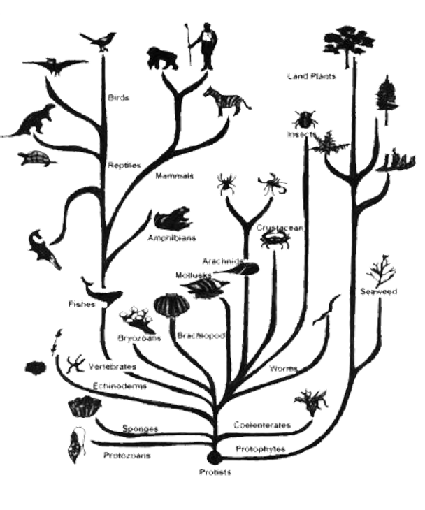

Title: Classes
Author: Jon Reades
Theme: casa notes
Palette: Purple
Size: Wide

---
Layout: Title
# Keeping it Classy

---
## What's a Class?

> A tight **coupling** or association of data structures with the methods or functions that act on the data. 

It is the **template** for producing new objects...

---
## What's an Object?

Objects are **instantiated** versions of classes: `hello world` is an **instance** of a string, and `['A','B',1,3]` is an **instance** of a list. 

The class is your recipe, the object is your pizza... 
---
### Really... Like a Pizza!

```
class pizza:
  base = 'sourdough'
  
  def __init__(self, sauce='tomato', cheese='mozzarella'):
    self.toppings = []
    self.sauce = sauce
    self.cheese = cheese
    
  def add_topping(self, topping: str) -> None:
    self.toppings.insert(len(self.toppings), topping)
  
  def get_pizza(self) -> list:
    ingredients = [self.base, self.sauce, self.cheese]
    ingredients.extend(self.toppings)
    return ingredients
```
---
### Pizza in Action

```
p = pizza(sauce='white')
p.add_topping('peppers')
p.add_topping('chilis')
p.get_pizza()
> ['sourdough', 'white', 'mozzarella', 'peppers', 'chilis']
```

---
### Recap

A class is defined by:
```
class <name>:
  ...
```
A class is initialised by:
```
  def __init__(self, <any parameters>):
    ...
```
This variable is complicated:
```
  base = 'sourdough'
```

---
### Check it Out
```
p1 = pizza(sauce='white')
p1.add_topping('peppers')
p1.add_topping('chilis')

p2 = pizza()
p2.base = "Plain old base"
p2.add_topping('pineapple')
p2.add_topping('ham')

p1.get_pizza()
> ['sourdough', 'white', 'mozzarella', 'peppers', 'chilis']
p2.get_pizza()
> ['Plain old base', 'tomato', 'mozzarella', 'pineapple', 'ham']
```

--- 
### But...

```
pizza.base='Crusty'
p1.get_pizza()
> ['Crusty', 'white', 'mozzarella', 'peppers', 'chilis']
p2.get_pizza()
> ['Plain old base', 'tomato', 'mozzarella', 'pineapple', 'ham']

p3 = pizza()
p3.get_pizza()
> ['Crusty', 'tomato', 'mozzarella']
```

---
## Principles of Objects-Oriented Design

Three key terms:
1. Encapsulation: the bundling of the data and the methods that work on that data in **one unit**; data is *often* accessed via **methods** and not directly. I don't need to care **how** something works, only **that** it works.
2. Inheritance: classes can **inherit** functionality from 'parents' and then **extend** this in useful ways. So `geopandas` extends `pandas`, and `movingpandas` extends `geopandas`!
3. Polymorphism: a 'child' class can be use anywhere its parent class can be used because it only **extends** (*i.e.* adds) functionality and does *not* break parent behaviour.

---


---


---
## All Designs Are Flawed


Where do unicycles and rickshaws go?

---
## Classes vs Packages

> Functionally, a class and a package are effectively indistinguishable, but a _class_ produces objects, whereas a _package_ is a group of related 'things' that may, or may not, include classes.

Ugh, now try to keep _this_ straight in your head.

---
## Key Takeaways

1. You’ve been using Classes and Methods since you started. 
2. You can ‘package up’ useful code into functions, and useful functions into packages.
3. Keep an eye out for copy+pasting the same code.
4. Together, packages and classes will turbo-charge your programming skills.
5. You can stand on the shoulders of giants!
