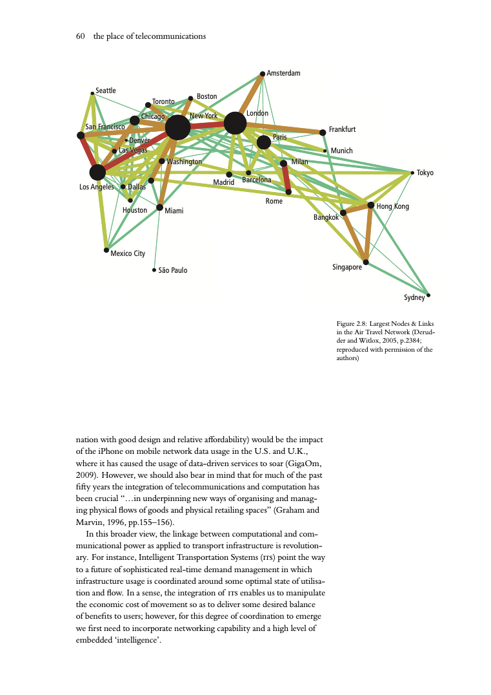
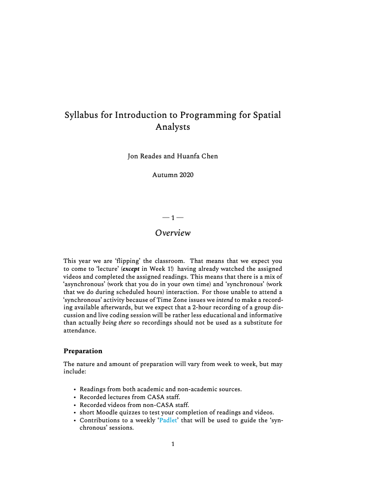

Theme: casa notes
Palette: Purple
Size: Wide
Title: File Formats
Author: Jon Reades

---

Layout: Title

# From Note(book)s to Documents

---

## Not Just for Code

> Markdown and Notebooks can be used for a lot more than just code! In conjunction with Pandoc and/or LaTeX they become platforms for publication.

---

### Recall: Tangled Workflows

It's not *just* about mixing code and comment, we *also* want:

- To separate *content* from *presentation*
- To define *mappings* between presentation styles
- To produce the *best-quality* output for the format chosen

^ Examples of this include CSS for web sites, LaTeX templates, and Markdown styles.

^ MVC approach to software design.

---

### Pandoc

Tool for converting documents *between* formats, including:

- Plain Text/YAML
- Markdown
- LaTeX/PDF
- HTML
- Jupyter Notebook
- XML/ODT/DOCX
- EPUB/DocBook
- BibTeX/JSON

---

### LaTeX

Intended for [type-setting of scientific documents](https://www.latex-project.org/about/) of any length, but has also been repurposed for slides, posters, CVs, and any other document you care to think of. It is *not* a word processor, it's more like a *compiler*.




^ This format is based on Edward Tufte's VSQD and can be found on [GitHub](https://tufte-latex.github.io/tufte-latex/).

---

### LaTeX in Practice

You  write LaTeX in any text editor, but specialist apps like [Texpad](https://www.texpad.com/) or [Overleaf](https://www.overleaf.com/) make it easier.

```latex
\documentclass[11pt,article,oneside]{memoir}
\newcommand{\bl}{\textsc{bl}~\/}
\usepackage{tabularx}

\begin{document}
\maketitle 

This report provides an overview of activities ...

\section{Applications}
A primary objective was the submission...
```

^ UCL has an institutional license for Overleaf. 

^ This document is then *compiled* (or 'typeset') with the commands provided by the preamble being interpreted and applied. Depending on the length of the document and sophistication of the styles it can take up to 3 or 4 minutes for a book-length document, but small documents should compile in a few seconds.

^ Compilation allows us to do things like have Master Documents that actually work, include PDFs, make forwards and backwards references.

---

### BibTeX

Provides bilbiographic support for LaTeX but widely used by other utilities as is *also* plain-text.

```bibtex
@article{Lavin:2019,
        Author = {Lavin, Matthew J.},
        Doi = {10.46430/phen0082},
        Journal = {The Programming Historian},
        Number = {8},
        Title = {Analyzing Documents with TF-IDF},
        Year = {2019},
        Bdsk-Url-1 = {https://doi.org/10.46430/phen0082}}

@incollection{Kitchin:2016,
        Author = {Kitchin, R. and Lauriault, T.P. and McArdie, G.},
        Booktitle = {Smart Urbanism},
        Chapter = {2},
        Editor = {Marvin, Luque-Ayala, McFarlane},
        Title = {Smart Cities and the Politics of Urban Data},
        Year = {2016}}
```

---

### Using BibTeX

To reference a document we then need to tell LaTeX or Pandoc where to look:

```latex
\bibliographystyle{apacite}
\bibliography{Spatial_Data_Chapter.bib}
```

With citations following formats like:

```latex
\citep[p.22]{Reades2018}
```

Or: 

```markdown
[@dignazio:2020, chap. 4]
```

---

### Reveal.js

JavaScript-based presentation framework. Can use Markdown (using the separator `---` to separate slides) to generate portable interactive slides including references/bibliographies.

Compare:

- https://github.com/darribas/wmn/blob/master/src/slides/lecture_01.md
- https://github.com/darribas/wmn/blob/master/src/slidedecks/lecture_01.html
- http://darribas.org/wmn/slidedecks/lecture_01.html#/

---

Layout: Split

From Markdown & TeX

```bash
pandoc Syllabus.md \
  -H ./bib/head.tex \
  -H ./bib/chapter.tex \
  -H ./bib/refs.tex \
  -V documentclass=memoir \
  --pdf-engine=xelatex \
  --filter=pandoc-citeproc \
  --metadata-file=metadata.yml \
  --highlight-style=pygments \
  -o Syllabus.pdf
```

+++

To PDF



---

### Pros & Cons

---

Layout: Split

#### Pros

- Simplicity (while writing)
- Flexibility of Form
- Version Control
- High-Quality Outputs

+++

#### Cons

- Complexity (when formatting)
- Collaboration (can be harder)

---

Layout: SectionTitle

## Recap of Formatting

---

### Headings

| Markdown              | LaTeX                             |
| --------------------- | --------------------------------- |
| `# Heading Level 1`   | `\section{Heading Level 1}`       |
| `## Heading Level 2`  | `\subsection{Heading Level 2}`    |
| `### Heading Level 3` | `\subsubsection{Heading Level 3}` |

---

### Inline Elements

| Markdown                   | LaTeX                                                        |
| -------------------------- | ------------------------------------------------------------ |
| `1. Numbered item 1`       | `\begin{enumerate} \n \item ... \end{enumerate}`             |
| `- Bulleted list item 1`   | `\begin{itemize} \n \item ... \n \end{itemize} `             |
| `_italics_` or `*italics*` | `\emph{italics}` or `textit{italics}`                        |
| `**bold**`                 | `\textbf{bold}`                                              |
| `> blockquote`             | `\begin{quote} \n blockquote \end{quote}`                    |
| ``Some `code` is here``    | `Some \texttt{code} is here`                                 |
| `[Link Text](URL)`         | `\href{Link Text}{URL}`                                      |
| ``   | ```\begin{figure}\n \includegraphics[opts]{...}\n \end{figure}``` |

---

### Mathematics

| Markdown         | LaTeX          |
| ---------------- | -------------- |
| `$$x = 5$$`      | `$x=5$`        |
| `$$\pi$$`        | `$\pi$`        |
| `$$e = mc^{2}$$` | `$e = mc^{2}$` |

$$
\pi \\
e = mc^{2} \\
\int_{0}^{\inf} x^2 \,dx \\
\sum_{n=1}^{\infty} 2^{-n} = 1
$$

Overleaf [has good documentation](https://www.overleaf.com/learn/latex/Main_Page) for most (basic) applications.

---

## Recap

> You will usually want to Google most things to do with laying out LaTeX code.

---

## Resources

- [Pandoc Demos](https://pandoc.org/demos.html)

- [Beginner's Guide to Jupyter Notebooks](https://towardsdatascience.com/beginners-guide-to-jupyter-notebook-8bb85b85085)

- [7 Essential Tips to Writing With Jupyter Notebooks](https://towardsdatascience.com/7-essential-tips-for-writing-with-jupyter-notebook-60972a1a8901#699a)

- [Version Control with Jupyter](https://towardsdatascience.com/version-control-with-jupyter-notebook-b9630bc5996e)

- [Sustainable Publishing using Pandoc and Markdown](https://programminghistorian.org/en/lessons/sustainable-authorship-in-plain-text-using-pandoc-and-markdown)

  