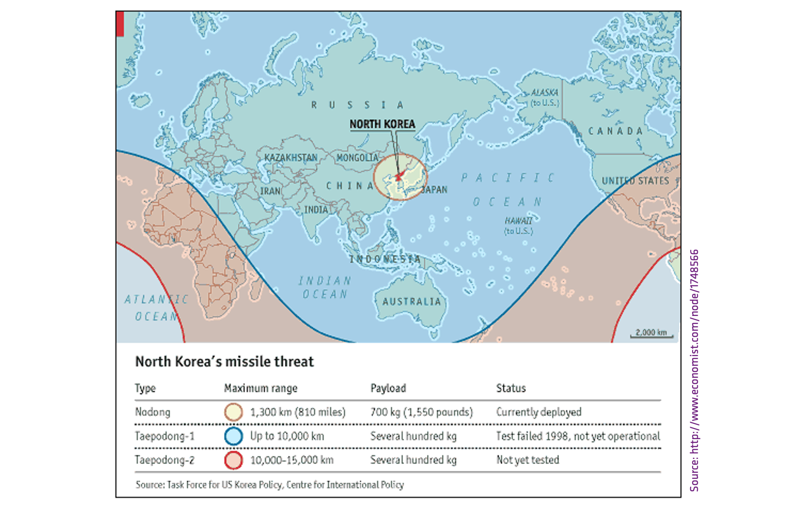
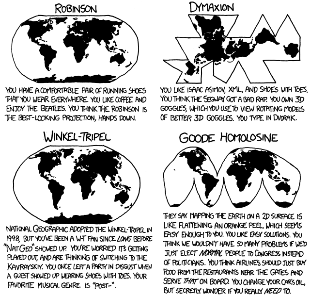

Theme: casa notes
Palette: Purple
Size: Wide
Title: File Formats
Author: Jon Reades

---

Layout: Title

# Transformation

---

### Why Transform?

Usually for the purposes of:

1. Normalisation, or...
2. Standardisation

---

### Transformation

Data *transformation* just means changing the raw data in some way to make it more tractable for analysis.

- Centring the mean on zero is an obvious example.
- But we can also do quite complicated things (with caution!) in order to get a distribution that we can work with using statistical tests that have certain expectations about the data we’re feeding them.

^ So, even though we add or subtract, multiply or divide, square or log the data, because we are doing the *same thing* to *every* observation the underlying relationships between the data are ‘unchanged’.

---

### Transformation in 1D

---

### Transformation in 1D

^ How is this any different?

---

### So...

$$
x-\bar{x}
$$

Transformations are **mathematical operations** applied to every observation in a data set that preserve **some** of the relationships between them.

---

### For Example

If we subtract the mean from everyone's height then we *can* immediately tell if someone is taller or shorter *than we would expect*.

If we subtract the mean from everyone's income then we *cannot* immediately tell if someone is earning more or less *that we would expect*.

So what is a **useful transformation** in one context, may not be in another!

---

### Fleshing This Out

*Question*: How can you tell if you did *better* **than everyone else** on the *Quiz* or on the *Data Set Biography*?

*Answer*: Just subtracting the mean is *not enough* because the distributions are not the same. For *that* we also need to standardise the data in some way.
$$
z = \dfrac{x-\bar{x}}{\sigma}
$$
Divide through by the distribution!

---

Layout: SectionTitle

# Standardisation

---

### Standardisation is...

> (Typically) About rescaling data to have a mean of 0 and a standard deviation of 1 (unit variance).

---

### Z-Score Standardisation

$$
\dfrac{x-\bar{x}}{\sigma}
$$

---

### Interquartile Standardisation

$$
\dfrac{x_{i}-x_{Q2}}{x_{Q3}-x_{Q1}}
$$

---

### Interdecile Standardisation

$$
\dfrac{x_{i}-x_{50^{th}}}{x_{90^{th}}-x_{10^{th}}}
$$

---

### Why Standardise?

Standardisation helps in several ways:

- We understand the properties of normal-ish distributions, and can simulate them easily.
- More 'power' in the statistical tools available.
- Many analyses assume that 'error' is random and symmetric (homoscedastic, not skewed).

---

Layout: SectionTitle

## Normalisation

---

### Normalisation is... 

> (Typically) About rescaling data to a range of [0,1].

---

### Proportional Normalisation

$$
\dfrac{x_{i}}{\sum{x}_{i=1}^{n}}
$$

---

### Range Normalisation

$$
\dfrac{x_{i}-x_{min}}{x_{max}-x_{min}}
$$

---

### Why Normalise?

Normalisation helps in several ways:

- Scaling is important for comparability
- Clustering is particularly sensitive to scale

---

Layout: SectionTitle

## Non-Linear Transformations

---

### Log Transformation

Recall: logs are the *inverse* of exponentiation!

- So if $$10^{3} = 1,000$$ then $$log_{10}(1,000) = 3$$.
- And if $$10^{0} = 1$$ then $$log_{10}(1) = 0$$

The Natural Log ($$e$$) has certain advantages over other logs.

^ Why is this so common? Esp. in social sciences?

---

### Why Log Transform?

Consider:

- The formula for the mean is $$\frac{\sum{x}}{n}$$.
- The formula for variance is $$\frac{(x-\bar{x})^{2}}{n}$$.

Consider what happens if $$(x-\bar{x})$$ is 10, 100, 1,000, or 10,000?

---

### Other Transforms...

- Square Root (often with count data)
- Arcsine/Angular (with percentages, proportions, text)
- Rank (with care on extreme distributions)
- Box-Cox and Yeo-Johnson (arbitrary power transformations)

---

## Some Issues

- To report measures of central tendency it's usually helpful to convert back to the original units.
- The more extreme the transformation the less meaningful measures of dispersion.
- Correlation can be significantly affected in either direction.
- Count data can be tricky because you should not have negative values (especially $$-\infty$$.

---

### When Transforms Don't Help

Arbitrarily transforming data isn’t a panacea. ‘Robust’ tests can be another approach when all else fails and two common approaches are:

- Working with the ‘Trimmed Mean’: cutting off, say, the top and bottom 5% of scores would start to remove skew and offer a more useful view of the central tendency of the data.
- Bootstrapping: by taking many sub-samples (usually of *n-*1 data points) we can build a picture of how certain metrics vary. 

---

Layout: SectionTitle

## Transforming Spatial Data

---

> All maps are inaccurate, the question is **by how much**?

---

### What's Wrong with this Map?

---

### That's Better!

---

### What's a Projection?

There is no way to 'properly' show a 3D sphere on a 2D plane, so every map is a **transformation** from higher dimensions into lower dimensions.

[Source](http://imgs.xkcd.com/comics/map_projections.png)

---

> Are spatial (a.k.a. geometrical) transformations any different from the other mathematical transformations covered in class?
>
> *ata exists in a ‘space’ that we can transform and manipulate in various ways **using functions** to serve our exploratory and analytical purposes.

---

### Resources

- [Normalisation vs Standardisation -- Quantitative analysis](https://towardsdatascience.com/normalization-vs-standardization-quantitative-analysis-a91e8a79cebf)
- [Transforming Data with R](https://www.youtube.com/watch?v=5571wc0iWCI)
- [Data Transformation and Normality Testing](https://www.youtube.com/watch?v=57An8xx3WjA)
- [Introduction to Logarithms](https://youtu.be/ntBWrcbAhaY)
- [What is 'e' and where does it come from?](https://youtu.be/pg827uDPFqA)
- [Logarithms - What is e?](https://youtu.be/_-x90wGBD8U)

