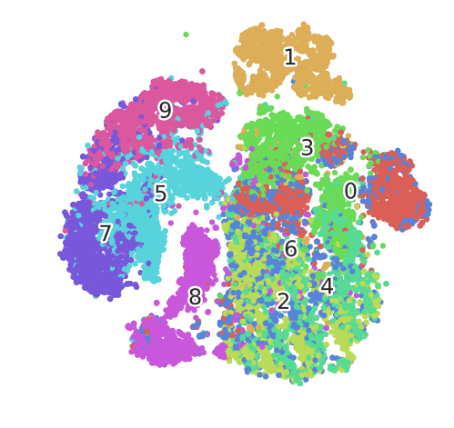

Theme: casa notes
Palette: Purple
Size: Wide
Title: File Formats
Author: Jon Reades

---
Layout: Title

# Dimensionality
## Curse and Blessing...

---
## Consider...

- More dimensions means **more information** about a process (yay!).
- More dimensions makes is **easier to seperate** observations (yay, clustering!).
- More dimensions **inflates inter-observational distance** measures (boo, especially with Euclidean measures).
- More dimensions increases the **risk of overfitting** (boo, especially with more features than observations!)

Or as [this site](https://analyticsindiamag.com/curse-of-dimensionality-and-what-beginners-should-do-to-overcome-it/) puts it:

- High-dimensional spaces have geometrical properties that are counter-intuitive and far from the properties observed in two- or three-dimensional spaces.
- Data analysis tools are often designed with intuitive properties and low-dimensional spaces in mind.

---
Layout: SectionTitle
## Dimensionality Reduction

---
### PCA

Workhorse dimensionality reduction method: simple, fast, and effective. Can be thought of as freely rotating axes to align with directions of maximum variance. I like this summary:

> PCA (Principal Components Analysis) gives us our ideal set of features. It creates a set of principal components that are **rank ordered by variance** (the first component has higher variance than the second, the second has higher variance than the third, and so on), **uncorrelated** (all components are orthogonal), and **low in number** (we can throw away the lower ranked components as they contain little signal).

But I particularly liked [this exposition](https://towardsdatascience.com/understanding-pca-fae3e243731d) in Towards Data Science.

---
### In Practice...

```python
from sklearn.decomposition import PCA
pca = PCA(n_components=2)
pca.fit(data)
print(pca.explained_variance_ratio_)
print(pca.singular_values_)
pca.transform(data)
```

See also: [Kernel PCA](https://scikit-learn.org/stable/modules/generated/sklearn.decomposition.KernelPCA.html#sklearn.decomposition.KernelPCA) for non-linear problems.

---
### RT(F)M

Why was I banging on about transformations?

> Linear dimensionality reduction using Singular Value Decomposition of the data to project it to a lower dimensional space. The input data is **centered but not scaled** for each feature before applying the SVD.

And notice too:

> Notice that this class **does not support sparse input**. See [`TruncatedSVD`](https://scikit-learn.org/stable/modules/generated/sklearn.decomposition.TruncatedSVD.html#sklearn.decomposition.TruncatedSVD) for an alternative with sparse data.

---
### In Practice...

You also need to consider the following:

- **Centering** is essential and done automatically.
- **Scaling** is *not* done automatically

There are two ways to think about scaling: if the underlying *scale* of your variables is somehow important then you *should not re-scale*, but as a *general rule* you will want to normalise (`[0..1]`) your data. There are [many good illustrations](https://stats.stackexchange.com/a/385782) of this process on [stats.stackexchange.com](https://stats.stackexchange.com/questions/385775/normalizing-vs-scaling-before-pca).

^ Think about the effect of comparing earthquake magnitudes with continental drift per year measured in kilometres and measured in micrometers. With rescaling there is no difference, but without the re-scaling the variance will change by several orders of magnitude!

^ Standardizing is usually done when the variables on which the PCA is performed are not measured on the same scale. Note that standardizing implies assigning equal importance to all variables.

---
### Other Considerations

> PCA is unsupervised, deterministic learning that does not take the output label into account. Other approaches (such as Linear Discriminant Analysis [note: *not* Latent Dirichlet Allocation]) consider the output as part of the transformation.

See [this discussion](https://stackabuse.com/implementing-lda-in-python-with-scikit-learn/).

---
### t-SNE

t-Distributed Stochastic Neighbour Embedding is best understood as a **visualisation** technique, not an **analytical** one. This is because it is *probabilistic* and not *deterministic*. 



---
### In Practice...

```python
from sklearn.manifold import TSNE
TSNE().fit_transform(<data>)
```

However, the choice of `perplexity` and `n_iter` at instantiation *matters*. In practice you will need to experiment with both.

t-SNE is also *much* harder computationally and it may be preferrable on very high-D data sets to **apply PCA *first* and then t-SNE to the reduced data set**! The output could then be fed to a clustering algorithm to make predictions about where new observations belong, but do not confuse that with *meaning*.

*Note:* I have also installed the [Multicore-TSNE](https://github.com/DmitryUlyanov/Multicore-TSNE) module in the Docker/Vagrant image.

---
### UMAP

Promising (non-deterministic) alternative to PCA that supports non-linear reduction while preserving both local and global structure. Not currently installed in Docker/Vagrant, but available under `umap-learn` (`conda install -c conda-forge umap-learn`). See examples on [umap.scikit-tda.org](https://umap.scikit-tda.org/parameters.html).


---
### Gotcha!

Both t-SNE and UMAP require very careful handling:

1. Hyperparameters matter
2. Cluster size means nothing
3. Cluster distances mean nothing
4. Clusters may mean nothing (low neighbour count/perplexity)
5. Outputs are stochastic (*not* deterministic)

Both likely require repeated testing and experimentation.

---
### Other Approaches

- Feature selection, including forwards/backwards (`sklearn.feature_selection` [here](https://scikit-learn.org/stable/modules/classes.html#module-sklearn.feature_selection))
- Decomposition (`sklearn.decomposition` [here](https://scikit-learn.org/stable/modules/classes.html#module-sklearn.decomposition))
- Other types of manifold learning (`sklearn.manifold` [here](https://scikit-learn.org/stable/modules/classes.html#module-sklearn.manifold))
- Random projection (`sklearn.random_projection` [here](https://scikit-learn.org/stable/modules/classes.html#module-sklearn.random_projection))
- Support Vector Machines (`sklearn.svm` [here](https://scikit-learn.org/stable/modules/classes.html#module-sklearn.svm))
- Ensemble Methods (such as Random Forests: `sklearn.ensemble.ExtraTreesClassifier` and `sklearn.ensemble.ExtraTreesRegressor` [here](https://scikit-learn.org/stable/modules/generated/sklearn.ensemble.ExtraTreesClassifier.html) and [here](https://scikit-learn.org/stable/modules/generated/sklearn.ensemble.ExtraTreesRegressor.html#sklearn.ensemble.ExtraTreesRegressor))

---
## Resources

- Rethinking 'distance' in New York City *Medium* [URL](https://medium.com/topos-ai/rethinking-distance-in-new-york-city-d17212d24919)
- Five Boroughs for the 21$$^{st}$$ Century *Medium* [URL](https://medium.com/topos-ai/five-boroughs-for-the-21st-century-8da941f53618)
- [Curse of Dimensionality](https://en.wikipedia.org/wiki/Curse_of_dimensionality)
- [The Curse of Dimensionality](https://towardsdatascience.com/the-curse-of-dimensionality-50dc6e49aa1e)
- [Importance of Feature Scaling](https://scikit-learn.org/stable/auto_examples/preprocessing/plot_scaling_importance.html)
- [Understanding PCA](https://towardsdatascience.com/understanding-pca-fae3e243731d)
- [Introduction to t-SNE in Python](https://www.datacamp.com/community/tutorials/introduction-t-sne)
- [How to Use t-SNE Effectively](https://distill.pub/2016/misread-tsne/)
- [How to tune the Hyperparameters of t-SNE](https://towardsdatascience.com/how-to-tune-hyperparameters-of-tsne-7c0596a18868)
- [Understanding UMAP](https://pair-code.github.io/understanding-umap/) (Compares to t-SNE)
- [How UMAP Works](https://towardsdatascience.com/how-exactly-umap-works-13e3040e1668)
- [3 New Techniques for Data-Dimensionality Reduction in ML](https://thenewstack.io/3-new-techniques-for-data-dimensionality-reduction-in-machine-learning/)
- [UMAP for Dimensionality Reduction](https://www.youtube.com/watch?v=nq6iPZVUxZU) (Video)
- [A Bluffer's Guide to Dimensionality Reduction](https://www.youtube.com/watch?v=9iol3Lk6kyU) (Video)

